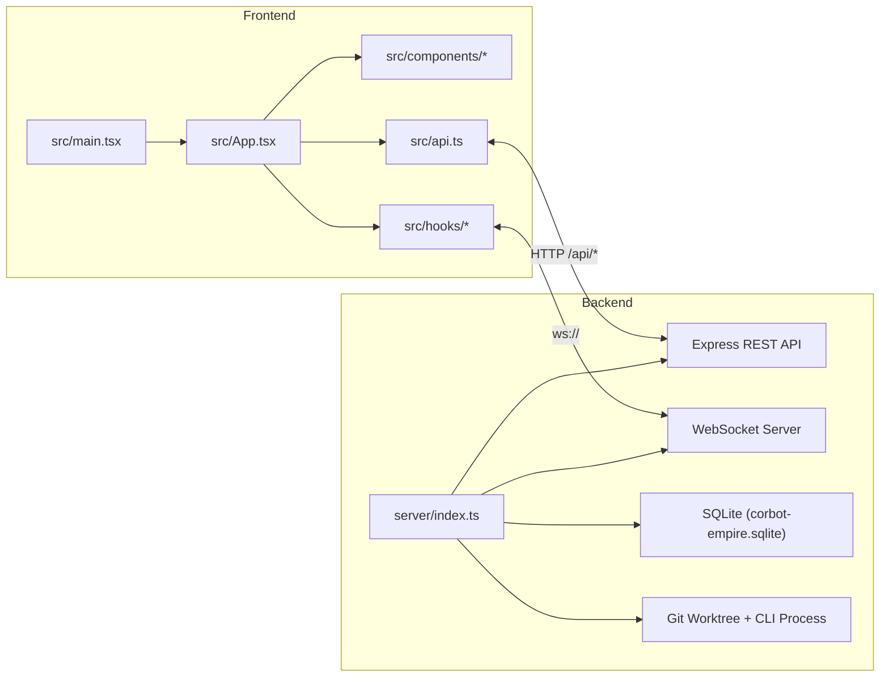
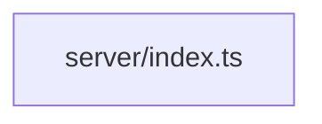

# Architecture Map

Generated at: 2026-03-18T16:30:44.646Z

## How to Regenerate

```bash
npm run arch:map
```

## System Overview



## Project Tree

```text
a6740a69
├── .github/
│   ├── ISSUE_TEMPLATE/
│   │   ├── bug_report.yml
│   │   ├── config.yml
│   │   ├── feature_request.yml
│   │   └── question.yml
│   ├── workflows/
│   │   └── ci.yml
│   └── pull_request_template.md
├── deploy/
│   ├── nginx/
│   │   └── corbot-empire.conf
│   ├── corbot-empire@.service
│   └── README.md
├── docs/
│   ├── architecture/
│   │   ├── architecture.json
│   │   ├── backend-dependencies.mmd
│   │   ├── CEO-STRUCTURE-MAP.md
│   │   ├── frontend-imports.mmd
│   │   ├── org-chart.mmd
│   │   ├── README.md
│   │   └── source-tree.txt
│   ├── plans/
│   │   ├── 2026-02-25-server-types-nocheck-removal.md
│   │   └── 2026-02-27-workflow-pack-mvp.md
│   ├── releases/
│   │   ├── README.md
│   │   ├── v1.0.1.md
│   │   ├── v1.0.2.md
│   │   ├── v1.0.3.md
│   │   ├── v1.0.4.md
│   │   ├── v1.0.5.md
│   │   ├── v1.0.6.md
│   │   ├── v1.0.7.md
│   │   ├── v1.0.8.md
│   │   ├── v1.0.9.md
│   │   ├── v1.1.0.md
│   │   ├── v1.1.1.md
│   │   ├── v1.1.2.md
│   │   ├── v1.1.3.md
│   │   ├── v1.1.4.md
│   │   ├── v1.1.5.md
│   │   ├── v1.1.6.md
│   │   ├── v1.1.7.md
│   │   ├── v1.1.8.md
│   │   ├── v1.1.9.md
│   │   ├── v1.2.0.md
│   │   ├── v1.2.1.md
│   │   ├── v1.2.2.md
│   │   ├── v1.2.3.md
│   │   ├── v1.2.4.md
│   │   ├── v2.0.0.md
│   │   ├── v2.0.1.md
│   │   ├── v2.0.2.md
│   │   ├── v2.0.3.md
│   │   └── v2.0.4.md
│   ├── reports/
│   │   ├── Sample_Slides/
│   │   │   ├── build-pptx.cjs
│   │   │   ├── build-pptx.mjs
│   │   │   ├── html2pptx.cjs
│   │   │   ├── slide-01.html
│   │   │   ├── slide-02.html
│   │   │   ├── slide-03.html
│   │   │   ├── slide-04.html
│   │   │   ├── slide-05.html
│   │   │   ├── slide-06.html
│   │   │   ├── slide-07.html
│   │   │   ├── slide-08.html
│   │   │   └── slide-09.html
│   │   └── PPT_Sample.pptx
│   ├── research/
│   │   └── agentic-workflow-best-practices.md
│   ├── api.md
│   ├── decision-inbox-checkpoint-2026-02-22.md
│   ├── DESIGN_SKILLS.md
│   ├── DESIGN.md
│   └── openapi.json
├── public/
│   ├── public/sprites/ (71 sprite files)
│   ├── climpire.svg
│   ├── corbot-empire.png
│   └── corbot-empire.svg
├── Sample_Img/
│   ├── claw-empire-intro.mp4
│   ├── CLI.png
│   ├── Dashboard.png
│   ├── Idle_CLI_view.png
│   ├── Kanban.png
│   ├── Meeting_Minutes.png
│   ├── OAuth.png
│   ├── Office_Manager.png
│   ├── Office_old.png
│   ├── Office_old1.png
│   ├── Office_old2.png
│   ├── Office_old3.png
│   ├── Office.png
│   ├── PPT_Gen0.png
│   ├── PPT_Gen1.png
│   ├── Report.png
│   ├── Script_view.png
│   ├── Setting.png
│   ├── Skill_Learn.png
│   ├── Skill_Remove.png
│   ├── Skills_Learning_Memory.png
│   ├── Skills.png
│   └── telegram.png
├── scripts/
│   ├── qa/
│   │   ├── office-theme-requirements-lib/
│   │   │   ├── constants.mjs
│   │   │   ├── contrast-audit.mjs
│   │   │   ├── reporting.mjs
│   │   │   ├── run.mjs
│   │   │   └── theme-helpers.mjs
│   │   ├── api-comm-test.mjs
│   │   ├── connectivity-lib.mjs
│   │   ├── interrupt-inject-http-smoke.mjs
│   │   ├── llm-comm-test.mjs
│   │   ├── oauth-comm-test.mjs
│   │   ├── office-console-smoke.mjs
│   │   ├── office-management-requirements.mjs
│   │   ├── office-performance-baseline.mjs
│   │   ├── office-resolution-compare.mjs
│   │   ├── office-theme-requirements.mjs
│   │   ├── project-path-api-smoke.mjs
│   │   └── run-comm-suite.mjs
│   ├── auto-apply-v1.0.5.mjs
│   ├── cleanup-staff.mjs
│   ├── convert-slides.mjs
│   ├── ensure-remotion-runtime.mjs
│   ├── generate-architecture-report.mjs
│   ├── generate-doro-sprites.mjs
│   ├── generate-intro-ppt.mjs
│   ├── kill-claw-empire-dev.ps1
│   ├── migrate-custom-skills-canonical.mjs
│   ├── openapi-contract.mjs
│   ├── openclaw-setup.ps1
│   ├── openclaw-setup.sh
│   ├── preflight-public.sh
│   ├── prepare-e2e-runtime.mjs
│   ├── run-claw-empire-dev-local.cmd
│   ├── run-e2e.mjs
│   ├── setup.mjs
│   ├── test-comm-status.mjs
│   └── verify-security-audit-log.mjs
├── server/
│   ├── config/
│   │   └── runtime.ts
│   ├── db/
│   │   ├── runtime.test.ts
│   │   └── runtime.ts
│   ├── gateway/
│   │   ├── client.test.ts
│   │   └── client.ts
│   ├── messenger/
│   │   ├── channels.ts
│   │   ├── discord-receiver.test.ts
│   │   ├── discord-receiver.ts
│   │   ├── session-agent-routing.test.ts
│   │   ├── session-agent-routing.ts
│   │   ├── telegram-receiver.test.ts
│   │   ├── telegram-receiver.ts
│   │   ├── token-crypto.ts
│   │   └── token-hint.ts
│   ├── modules/
│   │   ├── bootstrap/
│   │   │   ├── schema/
│   │   │   │   ├── api-providers-schema.test.ts
│   │   │   │   ├── base-schema.ts
│   │   │   │   ├── oauth-runtime.test.ts
│   │   │   │   ├── oauth-runtime.ts
│   │   │   │   ├── seeds.ts
│   │   │   │   ├── task-schema-migrations.ts
│   │   │   │   └── workflow-pack-seeds.ts
│   │   │   ├── helpers.ts
│   │   │   ├── message-idempotency.ts
│   │   │   └── security-audit.ts
│   │   ├── lifecycle/
│   │   │   └── register-graceful-shutdown.ts
│   │   ├── routes/
│   │   │   ├── collab/
│   │   │   │   ├── coordination/
│   │   │   │   │   ├── cross-dept-cooperation.test.ts
│   │   │   │   │   ├── cross-dept-cooperation.ts
│   │   │   │   │   ├── cross-dept-subtasks.ts
│   │   │   │   │   ├── report-routing.ts
│   │   │   │   │   └── types.ts
│   │   │   │   ├── announcement-response.ts
│   │   │   │   ├── chat-response.ts
│   │   │   │   ├── coordination.ts
│   │   │   │   ├── direct-chat-handlers.ts
│   │   │   │   ├── direct-chat-intent-utils.ts
│   │   │   │   ├── direct-chat-progress-summary.ts
│   │   │   │   ├── direct-chat-project-binding.ts
│   │   │   │   ├── direct-chat-runtime-reply.ts
│   │   │   │   ├── direct-chat-task-flow.pack-inference.test.ts
│   │   │   │   ├── direct-chat-task-flow.ts
│   │   │   │   ├── direct-chat-types.ts
│   │   │   │   ├── direct-chat.normalize.test.ts
│   │   │   │   ├── direct-chat.ts
│   │   │   │   ├── language-policy.test.ts
│   │   │   │   ├── language-policy.ts
│   │   │   │   ├── office-pack-agent-hydration.test.ts
│   │   │   │   ├── office-pack-agent-hydration.ts
│   │   │   │   ├── project-resolution.ts
│   │   │   │   ├── subtask-delegation-batch-messages.ts
│   │   │   │   ├── subtask-delegation-batch.ts
│   │   │   │   ├── subtask-delegation-prompt.ts
│   │   │   │   ├── subtask-delegation.ts
│   │   │   │   ├── subtask-summary.ts
│   │   │   │   ├── task-delegation-messages.ts
│   │   │   │   └── task-delegation.ts
│   │   │   ├── core/
│   │   │   │   ├── agents/
│   │   │   │   │   ├── crud.seed-filter.test.ts
│   │   │   │   │   ├── crud.ts
│   │   │   │   │   ├── index.ts
│   │   │   │   │   ├── process-inspector.ts
│   │   │   │   │   ├── spawn.ts
│   │   │   │   │   └── sprites.ts
│   │   │   │   ├── projects/
│   │   │   │   │   └── helpers.ts
│   │   │   │   ├── tasks/
│   │   │   │   │   ├── crud.ts
│   │   │   │   │   ├── crud.workflow-pack-filter.test.ts
│   │   │   │   │   ├── execution-control.test.ts
│   │   │   │   │   ├── execution-control.ts
│   │   │   │   │   ├── execution-run-auto-assign.test.ts
│   │   │   │   │   ├── execution-run-auto-assign.ts
│   │   │   │   │   ├── execution-run.ts
│   │   │   │   │   ├── execution.ts
│   │   │   │   │   └── subtasks.ts
│   │   │   │   ├── update-auto/
│   │   │   │   │   ├── apply-update.ts
│   │   │   │   │   ├── command-capture.ts
│   │   │   │   │   └── register.ts
│   │   │   │   ├── departments.ts
│   │   │   │   ├── github-routes.ts
│   │   │   │   └── projects.ts
│   │   │   ├── ops/
│   │   │   │   ├── messages/
│   │   │   │   │   ├── decision-inbox/
│   │   │   │   │   │   ├── messenger-bridge.ts
│   │   │   │   │   │   ├── messenger-notice-format.ts
│   │   │   │   │   │   ├── project-review-planning.ts
│   │   │   │   │   │   ├── project-review-reply.test.ts
│   │   │   │   │   │   ├── project-review-reply.ts
│   │   │   │   │   │   ├── project-timeout-items.ts
│   │   │   │   │   │   ├── review-round-items.ts
│   │   │   │   │   │   ├── review-round-planning.ts
│   │   │   │   │   │   ├── review-round-reply.ts
│   │   │   │   │   │   ├── state-helpers.ts
│   │   │   │   │   │   ├── timeout-reply.ts
│   │   │   │   │   │   ├── types.ts
│   │   │   │   │   │   ├── yolo-mode.test.ts
│   │   │   │   │   │   └── yolo-mode.ts
│   │   │   │   │   ├── announcements-routes.ts
│   │   │   │   │   ├── chat-routes.ts
│   │   │   │   │   ├── decision-inbox-routes.bridge.test.ts
│   │   │   │   │   ├── decision-inbox-routes.ts
│   │   │   │   │   ├── directive-leader-scope.test.ts
│   │   │   │   │   ├── directive-leader-scope.ts
│   │   │   │   │   └── directives-inbox-routes.ts
│   │   │   │   ├── oauth/
│   │   │   │   │   ├── helpers.ts
│   │   │   │   │   ├── routes.ts
│   │   │   │   │   └── status.ts
│   │   │   │   ├── skills/
│   │   │   │   │   ├── catalog-routes.ts
│   │   │   │   │   ├── learn-constants.ts
│   │   │   │   │   ├── learn-core.ts
│   │   │   │   │   ├── learn-routes.ts
│   │   │   │   │   ├── routes.ts
│   │   │   │   │   └── types.ts
│   │   │   │   ├── task-reports/
│   │   │   │   │   ├── helpers.test.ts
│   │   │   │   │   ├── helpers.ts
│   │   │   │   │   └── routes.ts
│   │   │   │   ├── terminal/
│   │   │   │   │   ├── pretty-stream-json.ts
│   │   │   │   │   ├── progress-hints.ts
│   │   │   │   │   └── routes.ts
│   │   │   │   ├── api-docs.ts
│   │   │   │   ├── api-providers.test.ts
│   │   │   │   ├── api-providers.ts
│   │   │   │   ├── custom-skills.ts
│   │   │   │   ├── messages.ts
│   │   │   │   ├── models-routes.ts
│   │   │   │   ├── settings-stats.seed-init.test.ts
│   │   │   │   ├── settings-stats.ts
│   │   │   │   ├── workflow-packs.ts
│   │   │   │   ├── worktrees-and-usage.test.ts
│   │   │   │   └── worktrees-and-usage.ts
│   │   │   ├── shared/
│   │   │   │   ├── project-assignments.ts
│   │   │   │   └── types.ts
│   │   │   ├── collab.ts
│   │   │   ├── core.ts
│   │   │   ├── ops.ts
│   │   │   ├── update-auto-command.test.ts
│   │   │   ├── update-auto-command.ts
│   │   │   ├── update-auto-lock.test.ts
│   │   │   ├── update-auto-lock.ts
│   │   │   ├── update-auto-policy.test.ts
│   │   │   ├── update-auto-policy.ts
│   │   │   ├── update-auto-utils.test.ts
│   │   │   └── update-auto-utils.ts
│   │   ├── workflow/
│   │   │   ├── agents/
│   │   │   │   ├── providers/
│   │   │   │   │   ├── api-provider-tools.ts
│   │   │   │   │   ├── credential-tools.ts
│   │   │   │   │   ├── http-agent-tools.ts
│   │   │   │   │   ├── oauth-tools.ts
│   │   │   │   │   ├── process-tools.ts
│   │   │   │   │   ├── stream-tools.ts
│   │   │   │   │   ├── types.ts
│   │   │   │   │   └── usage-cli-tools.ts
│   │   │   │   ├── cli-runtime.ts
│   │   │   │   ├── providers.ts
│   │   │   │   ├── subtask-routing.ts
│   │   │   │   └── subtask-seeding.ts
│   │   │   ├── core/
│   │   │   │   ├── worktree/
│   │   │   │   │   ├── lifecycle.test.ts
│   │   │   │   │   ├── lifecycle.ts
│   │   │   │   │   ├── merge.ts
│   │   │   │   │   └── shared.ts
│   │   │   │   ├── cli-tools.test.ts
│   │   │   │   ├── cli-tools.ts
│   │   │   │   ├── conversation-context-tools.ts
│   │   │   │   ├── conversation-types.ts
│   │   │   │   ├── interrupt-injection-tools.test.ts
│   │   │   │   ├── interrupt-injection-tools.ts
│   │   │   │   ├── meeting-prompt-tools.test.ts
│   │   │   │   ├── meeting-prompt-tools.ts
│   │   │   │   ├── one-shot-runner.ts
│   │   │   │   ├── project-context-tools.ts
│   │   │   │   ├── prompt-skills.test.ts
│   │   │   │   ├── prompt-skills.ts
│   │   │   │   ├── reply-core-tools.ts
│   │   │   │   ├── video-skill-bootstrap.test.ts
│   │   │   │   └── video-skill-bootstrap.ts
│   │   │   ├── orchestration/
│   │   │   │   ├── meetings/
│   │   │   │   │   ├── leader-selection.test.ts
│   │   │   │   │   ├── leader-selection.ts
│   │   │   │   │   ├── minutes.ts
│   │   │   │   │   ├── presence.ts
│   │   │   │   │   ├── review-consensus-outcome.ts
│   │   │   │   │   └── review-consensus.ts
│   │   │   │   ├── execution-start-task.ts
│   │   │   │   ├── meetings.ts
│   │   │   │   ├── planned-approval.ts
│   │   │   │   ├── planning-archive-tools.ts
│   │   │   │   ├── progress-notify-tools.ts
│   │   │   │   ├── report-flow-helpers.ts
│   │   │   │   ├── report-workflow-tools.ts
│   │   │   │   ├── review-finalize-tools.ts
│   │   │   │   ├── review-finalize-tools.video-gate.test.ts
│   │   │   │   ├── run-complete-handler.ts
│   │   │   │   ├── run-complete-handler.video-review.test.ts
│   │   │   │   ├── session-review-tools.ts
│   │   │   │   └── video-render-delegation-state.ts
│   │   │   ├── packs/
│   │   │   │   ├── definitions.ts
│   │   │   │   ├── department-scope.ts
│   │   │   │   ├── execution-guidance.test.ts
│   │   │   │   ├── execution-guidance.ts
│   │   │   │   ├── task-pack-resolver.test.ts
│   │   │   │   ├── task-pack-resolver.ts
│   │   │   │   ├── video-artifact.test.ts
│   │   │   │   ├── video-artifact.ts
│   │   │   │   ├── video-render-engine-gate.test.ts
│   │   │   │   └── video-render-engine-gate.ts
│   │   │   ├── agents.ts
│   │   │   ├── core.ts
│   │   │   ├── meeting-prompt-utils.test.ts
│   │   │   ├── meeting-prompt-utils.ts
│   │   │   └── orchestration.ts
│   │   ├── deferred-runtime.ts
│   │   ├── lifecycle.ts
│   │   ├── routes.ts
│   │   ├── runtime-helper-keys.ts
│   │   └── workflow.ts
│   ├── oauth/
│   │   └── helpers.ts
│   ├── scripts/
│   │   └── cleanup-staff.test.ts
│   ├── security/
│   │   ├── auth.test.ts
│   │   └── auth.ts
│   ├── test/
│   │   ├── setup.ts
│   │   └── smoke.test.ts
│   ├── types/
│   │   ├── lang.ts
│   │   ├── runtime-context-auto-augmented.ts
│   │   └── runtime-context.ts
│   ├── ws/
│   │   ├── hub.test.ts
│   │   └── hub.ts
│   ├── index.ts
│   ├── server-main.ts
│   └── vitest.config.ts
├── slides/
│   ├── generate-pptx.mjs
│   ├── html2pptx.cjs
│   ├── slide-01.html
│   ├── slide-02.html
│   ├── slide-03.html
│   ├── slide-04.html
│   ├── slide-05.html
│   ├── slide-06.html
│   ├── slide-07.html
│   ├── slide-08.html
│   ├── slide-09.html
│   ├── slide-10.html
│   ├── slide-11.html
│   └── slide-12.html
├── src/
│   ├── api/
│   │   ├── core.ts
│   │   ├── messaging-runtime-oauth.ts
│   │   ├── organization-projects.ts
│   │   ├── providers-reports-github.ts
│   │   └── workflow-skills-subtasks.ts
│   ├── app/
│   │   ├── AppHeaderBar.mobile-office-pack.test.tsx
│   │   ├── AppHeaderBar.tsx
│   │   ├── AppLoadingScreen.tsx
│   │   ├── AppMainLayout.tsx
│   │   ├── AppOverlays.tsx
│   │   ├── constants.ts
│   │   ├── decision-inbox.ts
│   │   ├── office-pack-display.test.ts
│   │   ├── office-pack-display.ts
│   │   ├── office-workflow-pack.test.ts
│   │   ├── office-workflow-pack.ts
│   │   ├── sub-agent-events.ts
│   │   ├── task-workflow-pack.test.ts
│   │   ├── task-workflow-pack.ts
│   │   ├── types.ts
│   │   ├── useActiveMeetingTaskId.ts
│   │   ├── useAppActions.ts
│   │   ├── useAppBootstrapData.ts
│   │   ├── useAppLabels.ts
│   │   ├── useAppViewEffects.ts
│   │   ├── useLiveSyncScheduler.ts
│   │   ├── useRealtimeSync.ts
│   │   ├── useUpdateStatusPolling.ts
│   │   └── utils.ts
│   ├── components/
│   │   ├── agent-detail/
│   │   │   ├── AgentDetailTabContent.tsx
│   │   │   └── constants.ts
│   │   ├── agent-manager/
│   │   │   ├── AgentCard.tsx
│   │   │   ├── AgentFormModal.tsx
│   │   │   ├── AgentsTab.tsx
│   │   │   ├── constants.ts
│   │   │   ├── DepartmentFormModal.tsx
│   │   │   ├── DepartmentsTab.tsx
│   │   │   ├── EmojiPicker.test.tsx
│   │   │   ├── EmojiPicker.tsx
│   │   │   ├── office-pack-sync.test.ts
│   │   │   ├── office-pack-sync.ts
│   │   │   ├── types.ts
│   │   │   └── utils.ts
│   │   ├── chat/
│   │   │   ├── decision-inbox-modal.meta.ts
│   │   │   ├── decision-inbox.test.ts
│   │   │   ├── decision-inbox.ts
│   │   │   ├── decision-request.test.ts
│   │   │   └── decision-request.ts
│   │   ├── chat-panel/
│   │   │   ├── ChatComposer.tsx
│   │   │   ├── ChatMessageList.sender-fallback.test.tsx
│   │   │   ├── ChatMessageList.tsx
│   │   │   ├── ChatModeHint.tsx
│   │   │   ├── ChatPanelHeader.tsx
│   │   │   ├── model.ts
│   │   │   ├── ProjectFlowDialog.tsx
│   │   │   └── useDecisionReply.ts
│   │   ├── dashboard/
│   │   │   ├── HeroSections.tsx
│   │   │   ├── model.tsx
│   │   │   └── OpsSections.tsx
│   │   ├── github-import/
│   │   │   ├── GitHubDeviceConnect.tsx
│   │   │   ├── GitHubImportWizard.tsx
│   │   │   └── model.ts
│   │   ├── office-view/
│   │   │   ├── buildScene-break-room.ts
│   │   │   ├── buildScene-ceo-hallway.ts
│   │   │   ├── buildScene-department-agent.ts
│   │   │   ├── buildScene-departments.ts
│   │   │   ├── buildScene-final-layers.ts
│   │   │   ├── buildScene-types.ts
│   │   │   ├── buildScene.ts
│   │   │   ├── CliUsagePanel.tsx
│   │   │   ├── drawing-core.ts
│   │   │   ├── drawing-furniture-a.ts
│   │   │   ├── drawing-furniture-b.ts
│   │   │   ├── model.ts
│   │   │   ├── officeTicker.ts
│   │   │   ├── officeTickerRoomAndDelivery.ts
│   │   │   ├── themes-locale.ts
│   │   │   ├── useCliUsage.ts
│   │   │   ├── useOfficeDeliveryEffects.ts
│   │   │   ├── useOfficePixiRuntime.ts
│   │   │   └── VirtualPadOverlay.tsx
│   │   ├── project-manager/
│   │   │   ├── ManualAssignmentSelector.tsx
│   │   │   ├── ManualAssignmentWarningDialog.tsx
│   │   │   ├── ManualPathPickerDialog.tsx
│   │   │   ├── MissingPathPromptDialog.tsx
│   │   │   ├── ProjectEditorPanel.tsx
│   │   │   ├── ProjectInsightsPanel.tsx
│   │   │   ├── ProjectSidebar.tsx
│   │   │   ├── types.ts
│   │   │   ├── useProjectManagerPathTools.ts
│   │   │   ├── useProjectSaveHandler.ts
│   │   │   └── utils.ts
│   │   ├── settings/
│   │   │   ├── gateway-settings/
│   │   │   │   ├── ChatEditorModal.tsx
│   │   │   │   ├── constants.ts
│   │   │   │   └── state.ts
│   │   │   ├── ApiAssignModal.test.tsx
│   │   │   ├── ApiAssignModal.tsx
│   │   │   ├── ApiSettingsTab.test.tsx
│   │   │   ├── ApiSettingsTab.tsx
│   │   │   ├── CliSettingsTab.tsx
│   │   │   ├── constants.tsx
│   │   │   ├── GatewaySettingsTab.characterization.test.tsx
│   │   │   ├── GatewaySettingsTab.tsx
│   │   │   ├── GeneralSettingsTab.tsx
│   │   │   ├── GitHubOAuthAppConfig.tsx
│   │   │   ├── Logos.tsx
│   │   │   ├── OAuthConnectCards.tsx
│   │   │   ├── OAuthConnectedProvidersSection.tsx
│   │   │   ├── OAuthSettingsTab.tsx
│   │   │   ├── SettingsTabNav.tsx
│   │   │   ├── types.ts
│   │   │   ├── useApiProvidersState.test.tsx
│   │   │   └── useApiProvidersState.ts
│   │   ├── skill-history/
│   │   │   └── utils.ts
│   │   ├── skills-library/
│   │   │   ├── ClassroomOverlay.tsx
│   │   │   ├── CustomSkillModal.tsx
│   │   │   ├── CustomSkillSection.tsx
│   │   │   ├── LearningModal.tsx
│   │   │   ├── model.tsx
│   │   │   ├── SkillsCategoryBar.tsx
│   │   │   ├── SkillsGrid.tsx
│   │   │   ├── SkillsHeader.tsx
│   │   │   ├── SkillsMemorySection.tsx
│   │   │   ├── useCustomSkillsState.ts
│   │   │   └── useSkillsLibraryState.ts
│   │   ├── taskboard/
│   │   │   ├── create-modal/
│   │   │   │   ├── CreateTaskModalView.tsx
│   │   │   │   ├── overlay-types.ts
│   │   │   │   ├── Overlays.tsx
│   │   │   │   ├── Sections.tsx
│   │   │   │   ├── submit-task.ts
│   │   │   │   ├── useDraftState.ts
│   │   │   │   ├── usePathHelperMessages.ts
│   │   │   │   ├── useProjectPickerState.test.tsx
│   │   │   │   └── useProjectPickerState.ts
│   │   │   ├── BulkHideModal.tsx
│   │   │   ├── constants.ts
│   │   │   ├── CreateTaskModal.tsx
│   │   │   ├── DiffModal.test.tsx
│   │   │   ├── DiffModal.tsx
│   │   │   ├── FilterBar.tsx
│   │   │   └── TaskCard.tsx
│   │   ├── terminal-panel/
│   │   │   └── model.ts
│   │   ├── AgentAvatar.tsx
│   │   ├── AgentDetail.tsx
│   │   ├── AgentManager.tsx
│   │   ├── AgentSelect.tsx
│   │   ├── AgentStatusPanel.tsx
│   │   ├── ChatPanel.tsx
│   │   ├── Dashboard.tsx
│   │   ├── DecisionInboxModal.tsx
│   │   ├── GitHubImportPanel.tsx
│   │   ├── MessageContent.tsx
│   │   ├── OfficeRoomManager.tsx
│   │   ├── OfficeView.tsx
│   │   ├── ProjectManagerModal.tsx
│   │   ├── ReportHistory.test.tsx
│   │   ├── ReportHistory.tsx
│   │   ├── SettingsPanel.tsx
│   │   ├── Sidebar.tsx
│   │   ├── SkillHistoryPanel.tsx
│   │   ├── SkillHistoryPanel.unlearn.test.tsx
│   │   ├── SkillsLibrary.esc-close.test.tsx
│   │   ├── SkillsLibrary.tsx
│   │   ├── task-report-agent.ts
│   │   ├── TaskBoard.tsx
│   │   ├── TaskReportPopup.test.tsx
│   │   ├── TaskReportPopup.tsx
│   │   └── TerminalPanel.tsx
│   ├── hooks/
│   │   ├── usePolling.test.tsx
│   │   ├── usePolling.ts
│   │   ├── useWebSocket.test.tsx
│   │   └── useWebSocket.ts
│   ├── styles/
│   │   ├── index.part01.css
│   │   ├── index.part02.css
│   │   ├── index.part03.css
│   │   ├── index.part04.css
│   │   └── index.part05.css
│   ├── test/
│   │   ├── setup.ts
│   │   └── smoke.test.ts
│   ├── types/
│   │   └── index.ts
│   ├── api-provider-presets.test.ts
│   ├── api.test.ts
│   ├── api.ts
│   ├── App.tsx
│   ├── i18n.test.ts
│   ├── i18n.ts
│   ├── index.css
│   ├── main.tsx
│   ├── ThemeContext.tsx
│   └── vite-env.d.ts
├── templates/
│   └── AGENTS-empire.md
├── tests/
│   └── e2e/
│       ├── ci-api-ops-and-docs.spec.ts
│       ├── ci-coverage-gap.spec.ts
│       ├── ci-docs-and-ops.spec.ts
│       ├── ci-manual-assignment.spec.ts
│       ├── ci-public-api-surface.spec.ts
│       ├── cleanup.ts
│       └── smoke.spec.ts
├── tools/
│   ├── playwright-mcp/
│   ├── ppt_team_agent/
│   └── taste-skill/
│       ├── README.upstream.md
│       └── skill.md
├── .dockerignore
├── .env.example
├── .git
├── .gitattributes
├── .gitignore
├── .gitmodules
├── .prettierignore
├── .prettierrc.json
├── AGENTS.md
├── CONTRIBUTING.md
├── docker-compose.yml
├── Dockerfile
├── eslint.config.mjs
├── index.html
├── install.ps1
├── install.sh
├── LICENSE
├── package.json
├── playwright.config.ts
├── pnpm-lock.yaml
├── README_jp.md
├── README_ko.md
├── README_zh.md
├── README.md
├── SECURITY.md
├── tsconfig.app.json
├── tsconfig.json
├── tsconfig.node.json
├── vite.config.ts
└── vitest.config.ts
```

## Frontend Import Graph

```mermaid
flowchart LR
  N1["src/App.tsx"]
  N2["src/ThemeContext.tsx"]
  N3["src/api-provider-presets.test.ts"]
  N4["src/api.test.ts"]
  N5["src/api.ts"]
  N6["src/api/core.ts"]
  N7["src/api/messaging-runtime-oauth.ts"]
  N8["src/api/organization-projects.ts"]
  N9["src/api/providers-reports-github.ts"]
  N10["src/api/workflow-skills-subtasks.ts"]
  N11["src/app/AppHeaderBar.mobile-office-pack.test.tsx"]
  N12["src/app/AppHeaderBar.tsx"]
  N13["src/app/AppLoadingScreen.tsx"]
  N14["src/app/AppMainLayout.tsx"]
  N15["src/app/AppOverlays.tsx"]
  N16["src/app/constants.ts"]
  N17["src/app/decision-inbox.ts"]
  N18["src/app/office-pack-display.test.ts"]
  N19["src/app/office-pack-display.ts"]
  N20["src/app/office-workflow-pack.test.ts"]
  N21["src/app/office-workflow-pack.ts"]
  N22["src/app/sub-agent-events.ts"]
  N23["src/app/task-workflow-pack.test.ts"]
  N24["src/app/task-workflow-pack.ts"]
  N25["src/app/types.ts"]
  N26["src/app/useActiveMeetingTaskId.ts"]
  N27["src/app/useAppActions.ts"]
  N28["src/app/useAppBootstrapData.ts"]
  N29["src/app/useAppLabels.ts"]
  N30["src/app/useAppViewEffects.ts"]
  N31["src/app/useLiveSyncScheduler.ts"]
  N32["src/app/useRealtimeSync.ts"]
  N33["src/app/useUpdateStatusPolling.ts"]
  N34["src/app/utils.ts"]
  N35["src/components/AgentAvatar.tsx"]
  N36["src/components/AgentDetail.tsx"]
  N37["src/components/AgentManager.tsx"]
  N38["src/components/AgentSelect.tsx"]
  N39["src/components/AgentStatusPanel.tsx"]
  N40["src/components/ChatPanel.tsx"]
  N41["src/components/Dashboard.tsx"]
  N42["src/components/DecisionInboxModal.tsx"]
  N43["src/components/GitHubImportPanel.tsx"]
  N44["src/components/MessageContent.tsx"]
  N45["src/components/OfficeRoomManager.tsx"]
  N46["src/components/OfficeView.tsx"]
  N47["src/components/ProjectManagerModal.tsx"]
  N48["src/components/ReportHistory.test.tsx"]
  N49["src/components/ReportHistory.tsx"]
  N50["src/components/SettingsPanel.tsx"]
  N51["src/components/Sidebar.tsx"]
  N52["src/components/SkillHistoryPanel.tsx"]
  N53["src/components/SkillHistoryPanel.unlearn.test.tsx"]
  N54["src/components/SkillsLibrary.esc-close.test.tsx"]
  N55["src/components/SkillsLibrary.tsx"]
  N56["src/components/TaskBoard.tsx"]
  N57["src/components/TaskReportPopup.test.tsx"]
  N58["src/components/TaskReportPopup.tsx"]
  N59["src/components/TerminalPanel.tsx"]
  N60["src/components/agent-detail/AgentDetailTabContent.tsx"]
  N61["src/components/agent-detail/constants.ts"]
  N62["src/components/agent-manager/AgentCard.tsx"]
  N63["src/components/agent-manager/AgentFormModal.tsx"]
  N64["src/components/agent-manager/AgentsTab.tsx"]
  N65["src/components/agent-manager/DepartmentFormModal.tsx"]
  N66["src/components/agent-manager/DepartmentsTab.tsx"]
  N67["src/components/agent-manager/EmojiPicker.test.tsx"]
  N68["src/components/agent-manager/EmojiPicker.tsx"]
  N69["src/components/agent-manager/constants.ts"]
  N70["src/components/agent-manager/office-pack-sync.test.ts"]
  N71["src/components/agent-manager/office-pack-sync.ts"]
  N72["src/components/agent-manager/types.ts"]
  N73["src/components/agent-manager/utils.ts"]
  N74["src/components/chat-panel/ChatComposer.tsx"]
  N75["src/components/chat-panel/ChatMessageList.sender-fallback.test.tsx"]
  N76["src/components/chat-panel/ChatMessageList.tsx"]
  N77["src/components/chat-panel/ChatModeHint.tsx"]
  N78["src/components/chat-panel/ChatPanelHeader.tsx"]
  N79["src/components/chat-panel/ProjectFlowDialog.tsx"]
  N80["src/components/chat-panel/model.ts"]
  N81["src/components/chat-panel/useDecisionReply.ts"]
  N82["src/components/chat/decision-inbox-modal.meta.ts"]
  N83["src/components/chat/decision-inbox.test.ts"]
  N84["src/components/chat/decision-inbox.ts"]
  N85["src/components/chat/decision-request.test.ts"]
  N86["src/components/chat/decision-request.ts"]
  N87["src/components/dashboard/HeroSections.tsx"]
  N88["src/components/dashboard/OpsSections.tsx"]
  N89["src/components/dashboard/model.tsx"]
  N90["src/components/github-import/GitHubDeviceConnect.tsx"]
  N91["src/components/github-import/GitHubImportWizard.tsx"]
  N92["src/components/github-import/model.ts"]
  N93["src/components/office-view/CliUsagePanel.tsx"]
  N94["src/components/office-view/VirtualPadOverlay.tsx"]
  N95["src/components/office-view/buildScene-break-room.ts"]
  N96["src/components/office-view/buildScene-ceo-hallway.ts"]
  N97["src/components/office-view/buildScene-department-agent.ts"]
  N98["src/components/office-view/buildScene-departments.ts"]
  N99["src/components/office-view/buildScene-final-layers.ts"]
  N100["src/components/office-view/buildScene-types.ts"]
  N101["src/components/office-view/buildScene.ts"]
  N102["src/components/office-view/drawing-core.ts"]
  N103["src/components/office-view/drawing-furniture-a.ts"]
  N104["src/components/office-view/drawing-furniture-b.ts"]
  N105["src/components/office-view/model.ts"]
  N106["src/components/office-view/officeTicker.ts"]
  N107["src/components/office-view/officeTickerRoomAndDelivery.ts"]
  N108["src/components/office-view/themes-locale.ts"]
  N109["src/components/office-view/useCliUsage.ts"]
  N110["src/components/office-view/useOfficeDeliveryEffects.ts"]
  N111["src/components/office-view/useOfficePixiRuntime.ts"]
  N112["src/components/project-manager/ManualAssignmentSelector.tsx"]
  N113["src/components/project-manager/ManualAssignmentWarningDialog.tsx"]
  N114["src/components/project-manager/ManualPathPickerDialog.tsx"]
  N115["src/components/project-manager/MissingPathPromptDialog.tsx"]
  N116["src/components/project-manager/ProjectEditorPanel.tsx"]
  N117["src/components/project-manager/ProjectInsightsPanel.tsx"]
  N118["src/components/project-manager/ProjectSidebar.tsx"]
  N119["src/components/project-manager/types.ts"]
  N120["src/components/project-manager/useProjectManagerPathTools.ts"]
  N121["src/components/project-manager/useProjectSaveHandler.ts"]
  N122["src/components/project-manager/utils.ts"]
  N123["src/components/settings/ApiAssignModal.test.tsx"]
  N124["src/components/settings/ApiAssignModal.tsx"]
  N125["src/components/settings/ApiSettingsTab.test.tsx"]
  N126["src/components/settings/ApiSettingsTab.tsx"]
  N127["src/components/settings/CliSettingsTab.tsx"]
  N128["src/components/settings/GatewaySettingsTab.characterization.test.tsx"]
  N129["src/components/settings/GatewaySettingsTab.tsx"]
  N130["src/components/settings/GeneralSettingsTab.tsx"]
  N131["src/components/settings/GitHubOAuthAppConfig.tsx"]
  N132["src/components/settings/Logos.tsx"]
  N133["src/components/settings/OAuthConnectCards.tsx"]
  N134["src/components/settings/OAuthConnectedProvidersSection.tsx"]
  N135["src/components/settings/OAuthSettingsTab.tsx"]
  N136["src/components/settings/SettingsTabNav.tsx"]
  N137["src/components/settings/constants.tsx"]
  N138["src/components/settings/gateway-settings/ChatEditorModal.tsx"]
  N139["src/components/settings/gateway-settings/constants.ts"]
  N140["src/components/settings/gateway-settings/state.ts"]
  N141["src/components/settings/types.ts"]
  N142["src/components/settings/useApiProvidersState.test.tsx"]
  N143["src/components/settings/useApiProvidersState.ts"]
  N144["src/components/skill-history/utils.ts"]
  N145["src/components/skills-library/ClassroomOverlay.tsx"]
  N146["src/components/skills-library/CustomSkillModal.tsx"]
  N147["src/components/skills-library/CustomSkillSection.tsx"]
  N148["src/components/skills-library/LearningModal.tsx"]
  N149["src/components/skills-library/SkillsCategoryBar.tsx"]
  N150["src/components/skills-library/SkillsGrid.tsx"]
  N151["src/components/skills-library/SkillsHeader.tsx"]
  N152["src/components/skills-library/SkillsMemorySection.tsx"]
  N153["src/components/skills-library/model.tsx"]
  N154["src/components/skills-library/useCustomSkillsState.ts"]
  N155["src/components/skills-library/useSkillsLibraryState.ts"]
  N156["src/components/task-report-agent.ts"]
  N157["src/components/taskboard/BulkHideModal.tsx"]
  N158["src/components/taskboard/CreateTaskModal.tsx"]
  N159["src/components/taskboard/DiffModal.test.tsx"]
  N160["src/components/taskboard/DiffModal.tsx"]
  N161["src/components/taskboard/FilterBar.tsx"]
  N162["src/components/taskboard/TaskCard.tsx"]
  N163["src/components/taskboard/constants.ts"]
  N164["src/components/taskboard/create-modal/CreateTaskModalView.tsx"]
  N165["src/components/taskboard/create-modal/Overlays.tsx"]
  N166["src/components/taskboard/create-modal/Sections.tsx"]
  N167["src/components/taskboard/create-modal/overlay-types.ts"]
  N168["src/components/taskboard/create-modal/submit-task.ts"]
  N169["src/components/taskboard/create-modal/useDraftState.ts"]
  N170["src/components/taskboard/create-modal/usePathHelperMessages.ts"]
  N171["src/components/taskboard/create-modal/useProjectPickerState.test.tsx"]
  N172["src/components/taskboard/create-modal/useProjectPickerState.ts"]
  N173["src/components/terminal-panel/model.ts"]
  N174["src/hooks/usePolling.test.tsx"]
  N175["src/hooks/usePolling.ts"]
  N176["src/hooks/useWebSocket.test.tsx"]
  N177["src/hooks/useWebSocket.ts"]
  N178["src/i18n.test.ts"]
  N179["src/i18n.ts"]
  N180["src/main.tsx"]
  N181["src/test/setup.ts"]
  N182["src/test/smoke.test.ts"]
  N183["src/types/index.ts"]
  N184["src/vite-env.d.ts"]
  N1 --> N2
  N1 --> N5
  N1 --> N13
  N1 --> N14
  N1 --> N15
  N1 --> N16
  N1 --> N19
  N1 --> N21
  N1 --> N25
  N1 --> N26
  N1 --> N27
  N1 --> N28
  N1 --> N29
  N1 --> N30
  N1 --> N31
  N1 --> N32
  N1 --> N33
  N1 --> N34
  N1 --> N84
  N1 --> N177
  N1 --> N179
  N1 --> N183
  N3 --> N5
  N4 --> N5
  N4 --> N6
  N5 --> N6
  N5 --> N7
  N5 --> N8
  N5 --> N9
  N5 --> N10
  N7 --> N6
  N7 --> N183
  N8 --> N6
  N8 --> N183
  N9 --> N6
  N10 --> N6
  N10 --> N183
  N11 --> N12
  N12 --> N25
  N12 --> N183
  N13 --> N179
  N14 --> N5
  N14 --> N12
  N14 --> N19
  N14 --> N21
  N14 --> N24
  N14 --> N25
  N14 --> N37
  N14 --> N41
  N14 --> N46
  N14 --> N50
  N14 --> N51
  N14 --> N55
  N14 --> N56
  N14 --> N179
  N14 --> N183
  N15 --> N5
  N15 --> N25
  N15 --> N36
  N15 --> N39
  N15 --> N40
  N15 --> N42
  N15 --> N45
  N15 --> N49
  N15 --> N58
  N15 --> N59
  N15 --> N84
  N15 --> N179
  N15 --> N183
  N17 --> N5
  N17 --> N84
  N17 --> N179
  N18 --> N19
  N18 --> N183
  N19 --> N183
  N20 --> N21
  N20 --> N183
  N21 --> N183
  N22 --> N16
  N22 --> N25
  N23 --> N24
  N23 --> N183
  N24 --> N21
  N24 --> N183
  N25 --> N183
  N26 --> N183
  N27 --> N5
  N27 --> N17
  N27 --> N21
  N27 --> N25
  N27 --> N34
  N27 --> N84
  N27 --> N179
  N27 --> N183
  N28 --> N5
  N28 --> N16
  N28 --> N17
  N28 --> N21
  N28 --> N25
  N28 --> N34
  N28 --> N84
  N28 --> N179
  N28 --> N183
  N29 --> N5
  N29 --> N25
  N29 --> N179
  N29 --> N183
  N30 --> N5
  N30 --> N25
  N30 --> N183
  N31 --> N5
  N31 --> N17
  N31 --> N34
  N31 --> N84
  N31 --> N183
  N32 --> N5
  N32 --> N16
  N32 --> N22
  N32 --> N25
  N32 --> N34
  N32 --> N183
  N33 --> N5
  N34 --> N16
  N34 --> N25
  N34 --> N179
  N34 --> N183
  N35 --> N183
  N36 --> N5
  N36 --> N35
  N36 --> N60
  N36 --> N61
  N36 --> N179
  N36 --> N183
  N37 --> N5
  N37 --> N21
  N37 --> N35
  N37 --> N63
  N37 --> N64
  N37 --> N65
  N37 --> N66
  N37 --> N68
  N37 --> N69
  N37 --> N72
  N37 --> N73
  N37 --> N179
  N37 --> N183
  N38 --> N35
  N38 --> N179
  N38 --> N183
  N39 --> N5
  N39 --> N35
  N39 --> N179
  N39 --> N183
  N40 --> N5
  N40 --> N35
  N40 --> N74
  N40 --> N76
  N40 --> N78
  N40 --> N79
  N40 --> N80
  N40 --> N81
  N40 --> N86
  N40 --> N179
  N40 --> N183
  N41 --> N87
  N41 --> N88
  N41 --> N89
  N41 --> N179
  N41 --> N183
  N42 --> N35
  N42 --> N44
  N42 --> N82
  N42 --> N84
  N42 --> N179
  N42 --> N183
  N43 --> N5
  N43 --> N90
  N43 --> N91
  N43 --> N92
  N43 --> N179
  N46 --> N2
  N46 --> N93
  N46 --> N94
  N46 --> N101
  N46 --> N105
  N46 --> N108
  N46 --> N109
  N46 --> N110
  N46 --> N111
  N46 --> N179
  N47 --> N5
  N47 --> N35
  N47 --> N43
  N47 --> N58
  N47 --> N113
  N47 --> N114
  N47 --> N115
  N47 --> N116
  N47 --> N117
  N47 --> N118
  N47 --> N119
  N47 --> N120
  N47 --> N121
  N47 --> N122
  N47 --> N179
  N47 --> N183
  N48 --> N49
  N48 --> N179
  N49 --> N5
  N49 --> N35
  N49 --> N58
  N49 --> N156
  N49 --> N179
  N49 --> N183
  N50 --> N1
  N50 --> N5
  N50 --> N126
  N50 --> N127
  N50 --> N129
  N50 --> N130
  N50 --> N135
  N50 --> N136
  N50 --> N141
  N50 --> N143
  N50 --> N179
  N50 --> N183
  N51 --> N179
  N51 --> N183
  N52 --> N5
  N52 --> N35
  N52 --> N144
  N52 --> N183
  N53 --> N5
  N53 --> N52
  N53 --> N183
  N54 --> N5
  N54 --> N55
  N54 --> N183
  N55 --> N145
  N55 --> N146
  N55 --> N147
  N55 --> N148
  N55 --> N149
  N55 --> N150
  N55 --> N151
  N55 --> N152
  N55 --> N155
  N55 --> N179
  N55 --> N183
  N56 --> N5
  N56 --> N47
  N56 --> N157
  N56 --> N158
  N56 --> N161
  N56 --> N162
  N56 --> N163
  N56 --> N179
  N56 --> N183
  N57 --> N58
  N57 --> N179
  N58 --> N5
  N58 --> N35
  N58 --> N156
  N58 --> N179
  N58 --> N183
  N59 --> N5
  N59 --> N35
  N59 --> N173
  N59 --> N179
  N59 --> N183
  N60 --> N61
  N60 --> N179
  N60 --> N183
  N61 --> N5
  N61 --> N179
  N62 --> N35
  N62 --> N69
  N62 --> N72
  N62 --> N179
  N62 --> N183
  N63 --> N5
  N63 --> N68
  N63 --> N69
  N63 --> N72
  N63 --> N179
  N63 --> N183
  N64 --> N62
  N64 --> N68
  N64 --> N72
  N64 --> N179
  N64 --> N183
  N65 --> N5
  N65 --> N68
  N65 --> N69
  N65 --> N72
  N65 --> N179
  N65 --> N183
  N66 --> N72
  N66 --> N179
  N66 --> N183
  N67 --> N68
  N68 --> N69
  N69 --> N72
  N69 --> N183
  N70 --> N71
  N70 --> N183
  N71 --> N183
  N72 --> N183
  N74 --> N77
  N74 --> N183
  N75 --> N76
  N75 --> N183
  N76 --> N35
  N76 --> N44
  N76 --> N86
  N76 --> N183
  N78 --> N35
  N78 --> N183
  N79 --> N183
  N80 --> N179
  N81 --> N80
  N81 --> N86
  N81 --> N183
  N82 --> N84
  N82 --> N179
  N82 --> N183
  N83 --> N84
  N83 --> N183
  N84 --> N86
  N84 --> N183
  N85 --> N86
  N87 --> N35
  N87 --> N89
  N87 --> N183
  N88 --> N35
  N88 --> N89
  N88 --> N179
  N88 --> N183
  N89 --> N179
  N90 --> N5
  N90 --> N179
  N91 --> N5
  N91 --> N92
  N91 --> N179
  N93 --> N5
  N93 --> N104
  N93 --> N108
  N93 --> N179
  N93 --> N183
  N94 --> N105
  N94 --> N108
  N94 --> N179
  N95 --> N100
  N95 --> N102
  N95 --> N103
  N95 --> N104
  N95 --> N105
  N95 --> N108
  N95 --> N179
  N95 --> N183
  N96 --> N102
  N96 --> N103
  N96 --> N104
  N96 --> N105
  N96 --> N108
  N96 --> N183
  N97 --> N100
  N97 --> N102
  N97 --> N103
  N97 --> N105
  N97 --> N183
  N98 --> N97
  N98 --> N100
  N98 --> N102
  N98 --> N103
  N98 --> N104
  N98 --> N105
  N98 --> N108
  N98 --> N179
  N98 --> N183
  N99 --> N105
  N99 --> N183
  N100 --> N2
  N100 --> N105
  N100 --> N108
  N100 --> N183
  N101 --> N35
  N101 --> N95
  N101 --> N96
  N101 --> N98
  N101 --> N99
  N101 --> N100
  N101 --> N105
  N101 --> N108
  N102 --> N105
  N102 --> N108
  N103 --> N102
  N103 --> N105
  N103 --> N108
  N104 --> N102
  N104 --> N108
  N105 --> N183
  N106 --> N102
  N106 --> N105
  N106 --> N107
  N106 --> N108
  N106 --> N183
  N107 --> N102
  N107 --> N105
  N108 --> N105
  N108 --> N179
  N108 --> N183
  N109 --> N5
  N109 --> N183
  N110 --> N102
  N110 --> N105
  N110 --> N108
  N110 --> N183
  N111 --> N35
  N111 --> N105
  N111 --> N106
  N111 --> N183
  N112 --> N5
  N112 --> N35
  N112 --> N119
  N112 --> N183
  N113 --> N119
  N114 --> N119
  N115 --> N119
  N116 --> N5
  N116 --> N112
  N116 --> N119
  N116 --> N183
  N117 --> N5
  N117 --> N119
  N117 --> N122
  N117 --> N183
  N118 --> N119
  N118 --> N183
  N119 --> N5
  N119 --> N183
  N120 --> N5
  N120 --> N119
  N121 --> N5
  N121 --> N119
  N121 --> N120
  N121 --> N183
  N122 --> N5
  N122 --> N119
  N123 --> N124
  N123 --> N141
  N123 --> N143
  N124 --> N21
  N124 --> N35
  N124 --> N141
  N124 --> N183
  N125 --> N5
  N125 --> N126
  N125 --> N141
  N125 --> N143
  N126 --> N124
  N126 --> N137
  N126 --> N141
  N126 --> N143
  N127 --> N137
  N127 --> N141
  N128 --> N129
  N129 --> N5
  N129 --> N35
  N129 --> N138
  N129 --> N139
  N129 --> N140
  N129 --> N141
  N129 --> N183
  N130 --> N141
  N130 --> N183
  N131 --> N5
  N131 --> N141
  N133 --> N137
  N133 --> N141
  N134 --> N5
  N134 --> N132
  N134 --> N137
  N134 --> N141
  N135 --> N5
  N135 --> N131
  N135 --> N133
  N135 --> N134
  N135 --> N137
  N135 --> N141
  N136 --> N141
  N137 --> N5
  N137 --> N132
  N138 --> N38
  N138 --> N139
  N138 --> N140
  N138 --> N141
  N138 --> N183
  N139 --> N183
  N140 --> N139
  N140 --> N141
  N140 --> N183
  N141 --> N5
  N141 --> N179
  N141 --> N183
  N142 --> N143
  N142 --> N183
  N143 --> N5
  N143 --> N141
  N143 --> N183
  N144 --> N5
  N144 --> N183
  N145 --> N5
  N145 --> N35
  N145 --> N153
  N145 --> N183
  N146 --> N5
  N146 --> N35
  N146 --> N153
  N146 --> N183
  N147 --> N5
  N147 --> N153
  N148 --> N5
  N148 --> N35
  N148 --> N153
  N148 --> N183
  N149 --> N153
  N150 --> N5
  N150 --> N35
  N150 --> N153
  N150 --> N183
  N151 --> N153
  N152 --> N52
  N152 --> N153
  N152 --> N183
  N153 --> N5
  N153 --> N179
  N153 --> N183
  N154 --> N5
  N154 --> N153
  N155 --> N5
  N155 --> N153
  N155 --> N154
  N155 --> N183
  N156 --> N183
  N157 --> N163
  N157 --> N179
  N157 --> N183
  N158 --> N163
  N158 --> N164
  N158 --> N167
  N158 --> N168
  N158 --> N169
  N158 --> N170
  N158 --> N172
  N158 --> N179
  N158 --> N183
  N159 --> N160
  N159 --> N179
  N160 --> N5
  N160 --> N179
  N161 --> N38
  N161 --> N163
  N161 --> N179
  N161 --> N183
  N162 --> N35
  N162 --> N38
  N162 --> N160
  N162 --> N163
  N162 --> N179
  N162 --> N183
  N163 --> N179
  N163 --> N183
  N164 --> N163
  N164 --> N165
  N164 --> N166
  N164 --> N167
  N164 --> N183
  N165 --> N163
  N165 --> N167
  N166 --> N38
  N166 --> N163
  N166 --> N183
  N167 --> N163
  N168 --> N5
  N168 --> N163
  N168 --> N183
  N169 --> N163
  N169 --> N183
  N170 --> N5
  N170 --> N163
  N171 --> N172
  N172 --> N5
  N172 --> N163
  N172 --> N183
  N173 --> N179
  N173 --> N183
  N174 --> N175
  N176 --> N5
  N176 --> N177
  N177 --> N5
  N177 --> N183
  N178 --> N179
  N180 --> N1
  N180 --> N2
  N183 --> N179
```

## Backend Dependency Graph



## API Routes (Server)

| Method | Route |
| --- | --- |


## API Calls (Frontend)

| Endpoint Pattern |
| --- |


## WebSocket Event Matrix

| Event | Server Broadcast | Frontend Listen |
| --- | --- | --- |
| agent_created |  | yes |
| agent_deleted |  | yes |
| agent_status |  | yes |
| announcement |  | yes |
| ceo_office_call |  | yes |
| chat_stream |  | yes |
| cli_output |  | yes |
| cross_dept_delivery |  | yes |
| departments_changed |  | yes |
| new_message |  | yes |
| pointerdown |  | yes |
| subtask_update |  | yes |
| task_report |  | yes |
| task_update |  | yes |

## DB Tables

| Table |
| --- |


## Sub-Agent Organization (from SQLite)


| Department | Agent | Role | CLI Provider |
| --- | --- | --- | --- |

